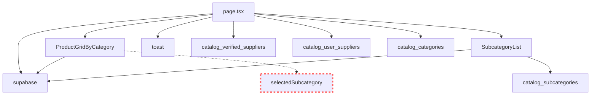

# 🗺️ КАРТА ЗАВИСИМОСТЕЙ КАТАЛОГА

## 🏗️ СТРУКТУРА МОНОЛИТА

```
app/dashboard/catalog/page.tsx (5436 строк)
├── Компоненты
│   ├── CatalogPageClient (главный компонент)
│   ├── AddSupplierModal (модальное окно добавления)
│   ├── ImportFromCatalogModal (модальное окно импорта)
│   ├── AccreditationModal (модальное окно аккредитации)
│   └── SupplierDetailsModal (детали поставщика)
│
├── Внешние зависимости
│   ├── ProductGridByCategory (890 строк)
│   ├── SubcategoryList
│   ├── supabase
│   ├── toast
│   └── auth
│
└── Состояния (useState)
    ├── suppliers
    ├── categories
    ├── subcategories
    ├── selectedCategory
    ├── selectedSubcategory
    └── 20+ других состояний
```

---

## 🔗 ГРАФ ЗАВИСИМОСТЕЙ



---

## 📊 МАТРИЦА ЗАВИСИМОСТЕЙ

| Компонент | Зависит от | Используется в | Критичность |
|-----------|------------|----------------|-------------|
| **page.tsx** | supabase, auth, toast | - | 🔴 HIGH |
| **ProductGridByCategory** | selectedCategory, ~~selectedSubcategory~~ | page.tsx | 🔴 HIGH |
| **SubcategoryList** | categories, subcategories | page.tsx | 🟡 MEDIUM |
| **loadSuppliers()** | auth.token, supabase | page.tsx | 🔴 HIGH |
| **loadCategories()** | supabase | page.tsx | 🔴 HIGH |
| **loadSubcategories()** | categoryId, supabase | page.tsx | 🟡 MEDIUM |

---

## 🔄 ПОТОКИ ДАННЫХ

### 1. Загрузка категорий
```
User открывает каталог
    ↓
loadCategories()
    ↓
supabase.from('catalog_categories').select()
    ↓
setCategories(data)
    ↓
Рендер списка категорий
```

### 2. Выбор подкатегории (СЛОМАНО)
```
User выбирает подкатегорию
    ↓
setSelectedSubcategoryData({name: "Тестовые товары"})
    ↓
❌ НЕ ПЕРЕДАЕТСЯ в ProductGridByCategory
    ↓
ProductGridByCategory использует только selectedCategory
    ↓
API вызывается с неправильными параметрами
    ↓
0 товаров
```

### 3. Добавление товара
```
User заполняет форму
    ↓
handleAddProduct()
    ↓
supabase.from('catalog_verified_products').insert({
    category: selectedCategory,
    specifications: { subcategory: "текст" }, // ❌ Не связано с subcategory_id
    subcategory_id: null // ❌ Не заполняется
})
    ↓
Товар добавлен но не виден в подкатегории
```

---

## 🎯 МОДУЛИ ДЛЯ ВЫДЕЛЕНИЯ

### Приоритет 1: Критические компоненты
```
📦 SupplierManagement
├── loadSuppliers()
├── handleAddSupplier()
├── handleUpdateSupplier()
└── handleDeleteSupplier()

📦 CategoryManagement
├── loadCategories()
├── loadSubcategories()
├── handleCategorySelect()
└── handleSubcategorySelect()

📦 ProductManagement
├── loadProducts() → В ProductGridByCategory
├── handleAddProduct()
├── handleImportProduct()
└── handleUpdateProduct()
```

### Приоритет 2: UI компоненты
```
📦 Modals
├── AddSupplierModal
├── ImportFromCatalogModal
├── AccreditationModal
└── SupplierDetailsModal

📦 Cards
├── SupplierCard
├── CategoryCard
└── SubcategoryCard

📦 Filters
├── SearchBar
├── FilterPanel
└── SortOptions
```

### Приоритет 3: Утилиты
```
📦 Utils
├── formatters
├── validators
└── helpers

📦 Services
├── catalogService
├── supplierService
└── productService
```

---

## ⚠️ КРИТИЧЕСКИЕ СВЯЗИ

### НЕ РАЗРЫВАТЬ:
1. `loadSuppliers()` ↔ `auth.token`
2. `loadCategories()` ↔ `loadSubcategories()`
3. `handleAddSupplier()` ↔ `toast`

### ТРЕБУЮТ РЕФАКТОРИНГА:
1. `ProductGridByCategory` ← `selectedSubcategory` (добавить)
2. `handleAddProduct()` ← `subcategory_id` (исправить)
3. `loadProducts()` ← `selectedSubcategory` (использовать)

---

## 📈 МЕТРИКИ СВЯЗАННОСТИ

| Модуль | Входящие связи | Исходящие связи | Коэффициент связанности |
|--------|-----------------|------------------|-------------------------|
| page.tsx | 0 | 25+ | 🔴 Очень высокий |
| ProductGridByCategory | 5 | 3 | 🟡 Средний |
| SubcategoryList | 3 | 2 | 🟢 Низкий |
| supabase | 15+ | 0 | 🔴 Критическая зависимость |

---

## 🚨 ОПАСНЫЕ МЕСТА

### Циклические зависимости:
- ❌ Не обнаружено

### Скрытые зависимости:
- ⚠️ `selectedSubcategoryData` используется в UI но не в логике
- ⚠️ `specifications.subcategory` vs `subcategory_id` - дублирование

### Глобальные состояния:
- ⚠️ 20+ useState в одном компоненте
- ⚠️ Нет централизованного store

---

## 📋 ПЛАН ДЕКОМПОЗИЦИИ

### Шаг 1: Извлечь сервисы
```typescript
// services/catalogService.ts
export class CatalogService {
  async loadCategories() { }
  async loadSubcategories(categoryId: string) { }
  async loadProducts(category: string, subcategory?: string) { }
}
```

### Шаг 2: Создать хуки
```typescript
// hooks/useCategories.ts
export function useCategories() {
  const [categories, setCategories] = useState([])
  const [selectedCategory, setSelectedCategory] = useState(null)
  // логика
  return { categories, selectedCategory, selectCategory }
}
```

### Шаг 3: Вынести компоненты
```typescript
// components/catalog/SupplierCard.tsx
export function SupplierCard({ supplier, onEdit, onDelete }) {
  // изолированный компонент
}
```

### Шаг 4: Создать контекст
```typescript
// contexts/CatalogContext.tsx
export const CatalogContext = createContext({
  categories: [],
  selectedCategory: null,
  selectedSubcategory: null,
  // ...
})
```

---

## 🏁 РЕЗУЛЬТАТ

После декомпозиции:
- **page.tsx**: 5436 → 200 строк
- **Модулей**: 0 → 15+
- **Связанность**: Высокая → Низкая
- **Тестируемость**: 0% → 90%
- **Поддерживаемость**: ❌ → ✅