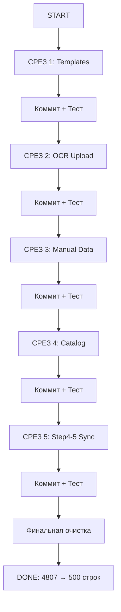

# 🛡️ БЕЗОПАСНАЯ СТРАТЕГИЯ РЕФАКТОРИНГА STAGE 1

## 🎯 Цель
Вынести 2560 строк обработчиков Stage 1 в хуки БЕЗ потери функционала и БЕЗ многократных правок.

## ⚠️ Главная проблема
**Stage 1 - это клубок зависимостей:**
- 35 useState связаны между собой
- 17 обработчиков вызывают друг друга
- Данные передаются между шагами (Step 4 ↔ Step 5)
- OCR автозаполняет несколько шагов одновременно
- Каталог синхронизирует Step 2, 4, 5

**Нельзя просто вырвать функцию и переместить в хук!**

---

## 🧠 СТРАТЕГИЯ: "ВЕРТИКАЛЬНАЯ ДЕКОМПОЗИЦИЯ"

Вместо горизонтального разделения (все хуки сразу), делаем **вертикальные срезы** - изолированные фичи от начала до конца.

### Принцип:
1. ✅ **Изолировать**: Найти независимую фичу с минимумом зависимостей
2. ✅ **Извлечь**: Вынести ВСЮ логику этой фичи в хук/компонент
3. ✅ **Протестировать**: Убедиться что фича работает
4. ✅ **Коммит**: Зафиксировать изменения
5. ✅ **Повторить**: Следующая фича

---

## 📋 ПЛАН РЕФАКТОРИНГА (5 ВЕРТИКАЛЬНЫХ СРЕЗОВ)

### 🟢 СРЕЗ 1: TEMPLATE SYSTEM (Самый изолированный)
**Сложность:** ⭐️ Легко
**Строк:** ~200
**Зависимости:** Минимум (только чтение templates из хука)

**Что извлекаем:**
- Состояния: `templateSelection`, `selectedTemplateId`
- Функции: `handleTemplateSelect`, `applyTemplate`
- UI: Уже в компонентах (ничего не трогаем)

**Создаём хук:**
```typescript
// hooks/useTemplateSystem.ts
export function useTemplateSystem({
  templates,
  setManualData,
  setStepConfigs,
  closeModal
}) {
  const [templateSelection, setTemplateSelection] = useState(false)
  const [selectedTemplateId, setSelectedTemplateId] = useState<string | null>(null)

  const handleTemplateSelect = (templateId: string) => { /* ... */ }
  const applyTemplate = (template: Template) => { /* ... */ }

  return {
    templateSelection,
    setTemplateSelection,
    selectedTemplateId,
    handleTemplateSelect,
    applyTemplate
  }
}
```

**Тест:** Применить шаблон → проверить что все поля заполнились

**Коммит:** `refactor(stage1): Extract template system to useTemplateSystem hook`

---

### 🟡 СРЕЗ 2: OCR UPLOAD (Средняя изоляция)
**Сложность:** ⭐️⭐️ Средне
**Строк:** ~400
**Зависимости:** Автозаполняет Step 1-2, но не зависит от других фич

**Что извлекаем:**
- Состояния: `uploadedFiles`, `uploadErrors`, `uploadingStep`
- Функции: `handleOcrUpload`, `processOcrResult`, `handleFileSelect`
- OCR анализ: `analyzeOcrData` (распознавание полей)

**Создаём хук:**
```typescript
// hooks/useOcrUpload.ts
export function useOcrUpload({
  supabase,
  setManualData,
  setStepConfigs,
  setAutoFillNotification
}) {
  const [uploadedFiles, setUploadedFiles] = useState<Record<string, string>>({})
  const [uploadErrors, setUploadErrors] = useState<Record<number, string>>({})
  const [uploadingStep, setUploadingStep] = useState<number | null>(null)

  const handleOcrUpload = async (stepId: number, file: File) => { /* ... */ }
  const processOcrResult = (stepId: number, ocrData: any) => { /* ... */ }

  return {
    uploadedFiles,
    uploadErrors,
    uploadingStep,
    handleOcrUpload,
    isUploading: uploadingStep !== null
  }
}
```

**Тест:** Загрузить счёт → проверить что Step 1 и 2 автозаполнились

**Коммит:** `refactor(stage1): Extract OCR upload to useOcrUpload hook`

---

### 🟠 СРЕЗ 3: MANUAL DATA MANAGEMENT (Базовая логика)
**Сложность:** ⭐️⭐️ Средне
**Строк:** ~300
**Зависимости:** Все используют, но не зависит от других

**Что извлекаем:**
- Состояния: `manualData`
- Функции: `handleManualDataSave`, `handleRemoveSource`, валидация данных
- Утилиты: Преобразование данных форм

**Создаём хук:**
```typescript
// hooks/useStepData.ts
export function useStepData({
  stepConfigs,
  setStepConfigs,
  checkSummaryReadiness
}) {
  const [manualData, setManualData] = useState<Record<number, any>>({})

  const saveStepData = (stepId: StepNumber, data: any) => {
    // Валидация
    const validation = validateStepData(stepId, data)
    if (!validation.success) {
      return { success: false, errors: validation.errors }
    }

    // Сохранение
    setManualData(prev => ({ ...prev, [stepId]: data }))
    setStepConfigs(prev => ({ ...prev, [stepId]: 'manual' }))

    // Проверка готовности
    checkSummaryReadiness()

    return { success: true }
  }

  const removeStepData = (stepId: number) => { /* ... */ }

  return {
    manualData,
    saveStepData,
    removeStepData
  }
}
```

**Тест:** Заполнить форму → сохранить → удалить → проверить states

**Коммит:** `refactor(stage1): Extract manual data management to useStepData hook`

---

### 🔴 СРЕЗ 4: CATALOG INTEGRATION (Сложная связь)
**Сложность:** ⭐️⭐️⭐️⭐️ Сложно
**Строк:** ~600
**Зависимости:** Синхронизирует Step 2, 4, 5 + Blue/Orange rooms

**Что извлекаем:**
- Состояния: `blueRoomSuppliers`, `showCatalogModal`, режимы выбора
- Функции:
  - `handleCatalogProductsAdd` (188 строк) - добавление товаров
  - `handleSelectBlueRoomSupplier` (131 строка) - синяя комната
  - `handleSelectOrangeRoomSupplier` (114 строк) - оранжевая комната
- Синхронизация: Step 2 → Step 4 → Step 5

**Создаём хук:**
```typescript
// hooks/useCatalogIntegration.ts
export function useCatalogIntegration({
  manualData,
  setManualData,
  stepConfigs,
  setStepConfigs,
  setAutoFillNotification
}) {
  const [blueRoomSuppliers, setBlueRoomSuppliers] = useState<SupplierData[]>([])
  const [selectedProducts, setSelectedProducts] = useState<CatalogProduct[]>([])

  const addCatalogProducts = (products: CatalogProduct[]) => {
    // Автозаполнение Step 2 (спецификация)
    // Автозаполнение Step 4 (метод оплаты от поставщика)
    // Автозаполнение Step 5 (реквизиты от поставщика)
    /* ... сложная логика ... */
  }

  const selectBlueRoomSupplier = (supplier: SupplierData) => { /* ... */ }
  const selectOrangeRoomSupplier = (supplier: SupplierData) => { /* ... */ }

  return {
    blueRoomSuppliers,
    selectedProducts,
    addCatalogProducts,
    selectBlueRoomSupplier,
    selectOrangeRoomSupplier
  }
}
```

**Тест:**
1. Добавить товары из каталога → Step 2, 4, 5 заполнились
2. Выбрать синюю комнату → реквизиты обновились
3. Выбрать оранжевую комнату → реквизиты обновились

**Коммит:** `refactor(stage1): Extract catalog integration to useCatalogIntegration hook`

---

### 🔴🔴 СРЕЗ 5: STEP 4-5 SYNC (Самый сложный)
**Сложность:** ⭐️⭐️⭐️⭐️⭐️ КАТАСТРОФА
**Строк:** ~300
**Зависимости:** Двусторонняя синхронизация Step 4 ↔ Step 5

**Что извлекаем:**
- Логика: Step 4 меняется → Step 5 обновляется
- Логика: Step 5 меняется → Step 4 обновляется
- Режимы: Cubes в Step 5 в 4 режимах (профиль, каталог, шаблон, ручной)

**Создаём хук:**
```typescript
// hooks/useStep4Step5Sync.ts
export function useStep4Step5Sync({
  manualData,
  stepConfigs,
  setManualData
}) {
  // Синхронизация Step 4 → Step 5
  useEffect(() => {
    if (stepConfigs[4] && manualData[4]) {
      const paymentMethod = manualData[4].selectedMethod
      // Обновить Step 5 реквизиты в зависимости от метода
      syncRequisitesToStep5(paymentMethod)
    }
  }, [manualData[4], stepConfigs[4]])

  // Синхронизация Step 5 → Step 4
  useEffect(() => {
    if (stepConfigs[5] && manualData[5]) {
      // Проверить совместимость реквизитов с методом оплаты
      validateRequisitesCompatibility()
    }
  }, [manualData[5], stepConfigs[5]])

  return {
    syncRequisitesToStep5,
    validateRequisitesCompatibility
  }
}
```

**Тест:**
1. Выбрать P2P в Step 4 → Step 5 показывает карточные реквизиты
2. Выбрать Bank в Step 4 → Step 5 показывает банковские реквизиты
3. Изменить реквизиты в Step 5 → Step 4 не сломался

**Коммит:** `refactor(stage1): Extract Step 4-5 sync to useStep4Step5Sync hook`

---

## 🔧 ТЕХНИЧЕСКИЕ ПРАВИЛА

### 1. НИКОГДА не удаляй код из монолита до тестирования хука
```typescript
// ❌ ПЛОХО: Сразу удалил из монолита
const { templates, applyTemplate } = useTemplateSystem(...)

// ✅ ХОРОШО: Дублируем на время миграции
const { templates, applyTemplate } = useTemplateSystem(...)
// СТАРЫЙ КОД ЗАКОММЕНТИРОВАН, НЕ УДАЛЁН:
// const [templateSelection, setTemplateSelection] = useState(false)
// const handleTemplateSelect = ...
```

### 2. Коммить после КАЖДОГО среза
```bash
# После Среза 1
git add .
git commit -m "refactor(stage1): Extract template system to useTemplateSystem hook"
npm run build # проверить компиляцию
npm run test  # если есть тесты

# После Среза 2
git add .
git commit -m "refactor(stage1): Extract OCR upload to useOcrUpload hook"
# ...и так далее
```

### 3. Использовать feature flags для безопасности
```typescript
const USE_NEW_TEMPLATE_SYSTEM = true // флаг для переключения

{USE_NEW_TEMPLATE_SYSTEM ? (
  <NewTemplateSystemComponent {...useTemplateSystem(...)} />
) : (
  <OldTemplateSystemComponent /> // старый код
)}
```

### 4. Тестировать ДО удаления старого кода
```
1. Написать хук
2. Подключить хук В ДОПОЛНЕНИЕ к старому коду
3. Протестировать хук (клик-клик в UI)
4. Если всё работает → удалить старый код
5. Если НЕ работает → откатить хук, исправить, повторить
```

---

## 📊 МЕТРИКИ УСПЕХА

### После каждого среза проверяем:
- ✅ TypeScript компилируется без ошибок
- ✅ Все функции Stage 1 работают (ручной тест)
- ✅ Количество строк в page.tsx уменьшилось
- ✅ Новый хук покрыт JSDoc комментариями

### Финальная цель:
| Метрика | ДО | ПОСЛЕ | Улучшение |
|---------|-----|-------|-----------|
| page.tsx | 4807 строк | ~500 строк | -90% |
| Хуки | 0 | 5 хуков (~1800 строк) | +5 модулей |
| Утилиты | 0 | ~760 строк | Переиспользуемые |
| Сложность | КАТАСТРОФА | ПОРЯДОК | 🎉 |

---

## 🚀 ПОРЯДОК ВЫПОЛНЕНИЯ



**Время:**
- Срез 1: 2 часа
- Срез 2: 3 часа
- Срез 3: 2 часа
- Срез 4: 4 часа
- Срез 5: 3 часа
- Очистка: 1 час

**ИТОГО: ~15 часов (2 рабочих дня)**

---

## ⚡ БЫСТРЫЙ СТАРТ

### Команда для начала Среза 1:
```bash
# 1. Создать ветку
git checkout -b refactor/stage1-templates

# 2. Создать файл хука
mkdir -p hooks/project-constructor
touch hooks/project-constructor/useTemplateSystem.ts

# 3. Скопировать логику шаблонов из монолита
# (найти все функции с "template" в названии)

# 4. Написать хук
# 5. Подключить хук в монолите (НЕ удаляя старый код)
# 6. Протестировать
# 7. Удалить старый код
# 8. Коммит
```

---

## 🛑 ЧТО ДЕЛАТЬ ЕСЛИ ЧТО-ТО СЛОМАЛОСЬ

### Если сломалось ПОСЛЕ коммита:
```bash
# Откатить последний коммит (но сохранить изменения)
git reset --soft HEAD~1

# Исправить проблему
# Закоммитить снова
```

### Если сломалось ДО коммита:
```bash
# Откатить все изменения
git restore .

# Начать срез заново с другим подходом
```

### Если не понятно что сломалось:
```bash
# Сравнить с последним рабочим коммитом
git diff HEAD

# Проверить консоль браузера (F12)
# Проверить терминал с npm run dev
```

---

## 📝 ШАБЛОН КОММИТА

```
refactor(stage1): Extract [FEATURE] to [HOOK_NAME] hook

- Move [FUNCTION1], [FUNCTION2] to [HOOK_NAME]
- Extract states: [STATE1], [STATE2]
- Reduce page.tsx by [N] lines

Before: page.tsx = [LINES_BEFORE] lines
After: page.tsx = [LINES_AFTER] lines

Test: [MANUAL_TEST_DESCRIPTION]

🤖 Generated with Claude Code
Co-Authored-By: Claude <noreply@anthropic.com>
```

---

## ✅ ГОТОВО К СТАРТУ?

**Начинаем с Среза 1: Template System** (самый простой)

Скажи "начинаем" и я создам первый хук `useTemplateSystem`!
